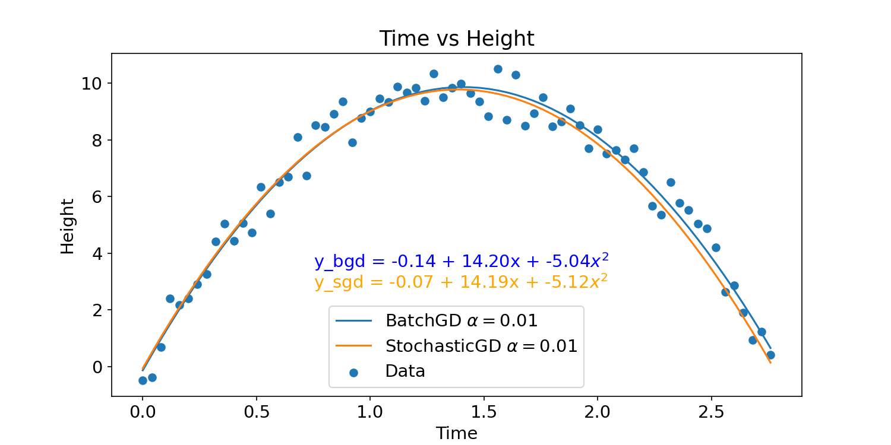
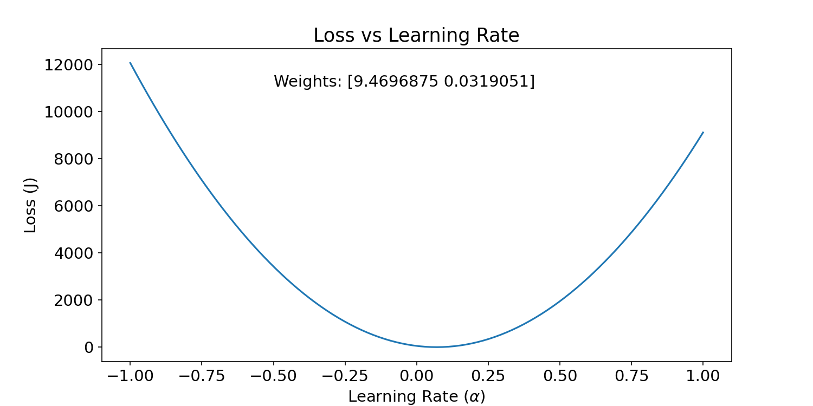
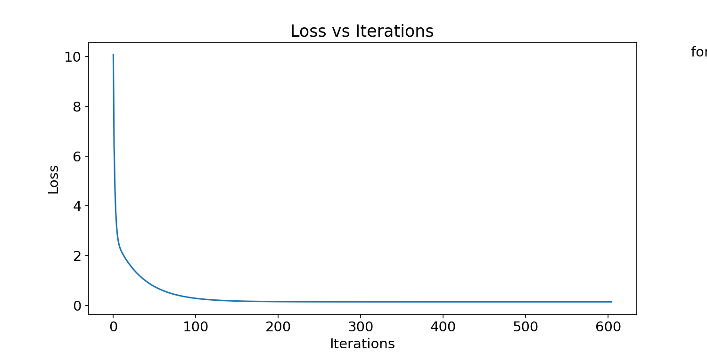
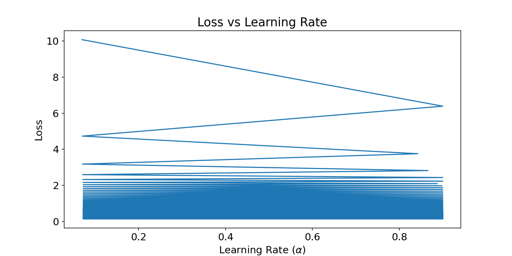
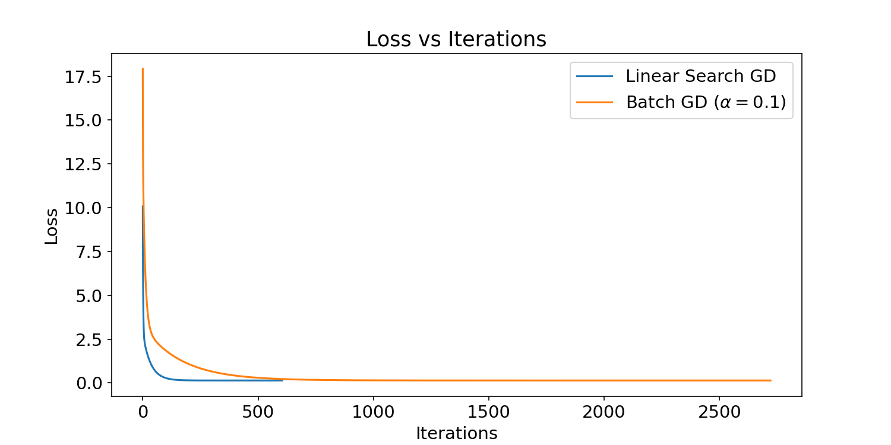

---
title: "Assignment 2 Plots"
author: "Shailja Kant Tiwari"
header-includes:
  - \usepackage{amssymb,amsmath,geometry}
  - \setmainfont{TeX Gyre Schola}
  - \setmathfont{TeX Gyre Schola Math}
output:
  pdf_document
---

# Assignment 2

## Problem: 1

This is the sactter plot of the given data set, where the x-axis is the Time and the y-axis is the Height.

---

This is the Plot of the fitted Non Linear Curve using Batch Gradient Descent at $\alpha$ = 0.01 and 50000 iterations.

---

Here I have plotted the Cost History (J) vs the number of iterations for Batch Gradient Descent and Stochastic Gradient Descent.

1. BatchGD: COnverges slowly but it's curve is more smooth. It may get stuck in a local minima.
2. StochasticGD: Converges faster but it's curve is not smooth. Because of this noise in it's curve it may surpass the local minima and converge to a global minima. 

---

From the closer look it is clearly visible that Stochoastic Gradient Descent is converged in less than 500 epochs. while Batch Gradient Descent took more than 3000 epochs to converge.

---

This is the common plot of the fitted Non Linear Curve by both the methods. It is clearly visible that both the models are almost same. But the Stochastic Gradient Descent is converged in less than 500 epochs. while Batch Gradient Descent took more than 3000 epochs to converge. So Stochastic Gradient Descent is faster than Batch Gradient Descent.

---

It is the plot of Cost History (J) vs Iterations. It can be seen that for $\alpha$ = 0.05 the Loss is very very High. It means that it is not converging.

---

This is the zoomed Plot for $\alpha$ = 0.5. Here we can see that for increasing number of iterations the loss was increasing upto ~180 epochs and then became inf and then nan.

---

This is the zoomed plot for $\alpha$ = 0.1, 0.05, 0.01. We can see that for the larger value of $\alpha$ the loss is converging faster.

---

This is the plot of the Loss Function (J) vs $\alpha$ for a given epoch. here Weights are randomly set and then the loss is calculated for different values of $\alpha$. We can see that this is a convex function. So we can use Linear Search to find the optimal value of $\alpha$.

---

This is a plot of Cost History (J) vs Iterations for the case of variable $\alpha$. Here I used Lenear Search (Secant Method) to find the optimal value of $\alpha$ at each iteration.

---

This is the plot between Loss (J) vs Learning Rate $\alpha$. Here we can see that it converged very effectively. And the value of $\alpha$ was always between 0.08 to 0.7.

---

Here we can easily see that for the same tolerance Linear Search converged in 792 epochs while Batch GD converged in 2703 epochs. Hence Linear Search GD is much faster than Batch GD.

---

## Problem: 2

This is the plot of Loss (J) vs Iterations. Here we can see that curve is coverging very smoothly.

---

## Problem: 3

This is the plot of Loss Function(Binary Cross Entropy) vs Iteration. From this curver we can see that :

1. It converges very fast. After 5 epochs it is almost converged.
2. Here the testing loss is more than the training loss. This means that the model is overfitting the data.

---

This is the plot of Accuracy vs Iteration for both the training and testing data. here also we can clearly see that model is not overfitting the data.

---