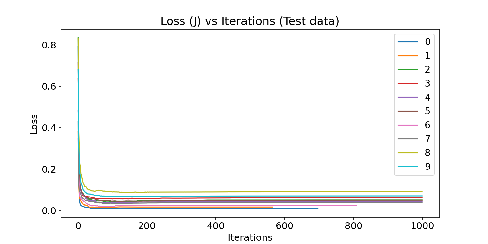
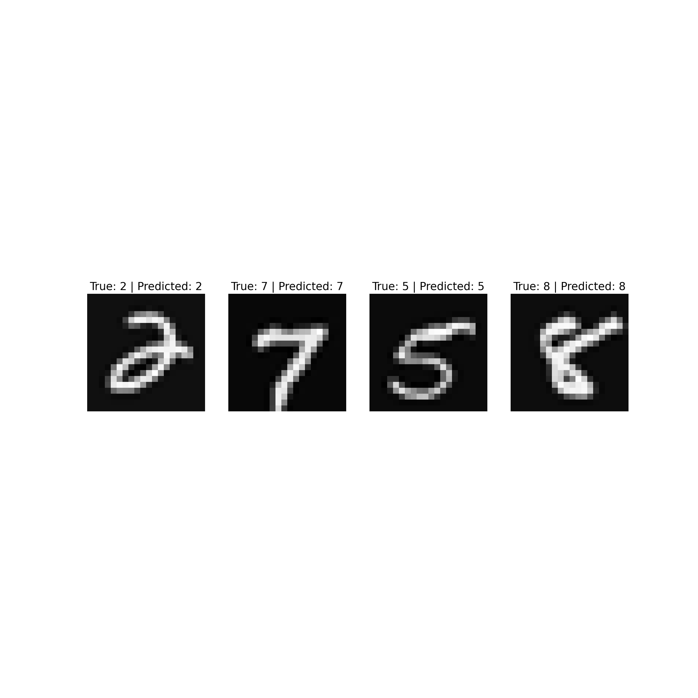

---
title: "Assignment 3 Plots"
author: "Shailja Kant Tiwari"
header-includes:
  - \usepackage{amssymb,amsmath,geometry}
  - \setmainfont{TeX Gyre Schola}
  - \setmathfont{TeX Gyre Schola Math}
output:
  pdf_document
---

# Assignment 3

## Problem: 1

This image contain the randomly selected 6 pictures from each label and plotted them in a grid.

---

This is a plot to find a optimum value of $\lambda$. In this we have trained our model for multiple values of $\lambda$ by training a model for just 50 iterations.
1. We found that as we are increasing the $\lambda$ our accuracy is decreasing. Hence training our final model for \$lambda$=0.03.

---

This is the plot of the Loss (J) vs Iterations for each class separately in training data. from this we can conclude:

1. We can see from here that loss for digits: 0, 1, 6 are very less that means our model is able to predict them with very confident.
2. Also in the labels in which it is much confident it stopped early also.

---

This is the same plot for test data. Here we can see that loss in both training data and test data is in same range so we can say that our model is doing well in unseen data too.

---

These are the few images from test data with their predicted labels and actual labels.

---

## Problem: 2

This is the random plot of the images from the Fashion-MNIST training data set from each category.

---

This is the plot between accuracy and Iterations for training data. Here we can see that loss is converging very smoothly but it is still decreasing.

1. That's why to avoid the overfitting we have added the L2 Regularization term to the loss with $\lambda$=0.05

---