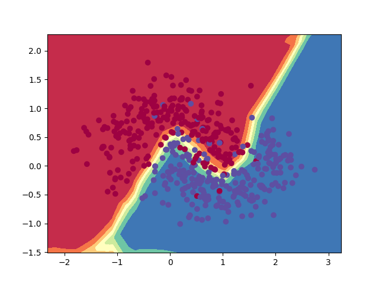

---
title: "Assignment 4 Plots"
author: "Shailja Kant Tiwari"
header-includes:
  - \usepackage{amssymb,amsmath,geometry}
  - \setmainfont{TeX Gyre Schola}
  - \setmathfont{TeX Gyre Schola Math}
output:
  pdf_document
---

# Assignment 4

## Problem: 1

This is the plot of the random 80 samples from the training data. 8 from each class.

---

This is the random plot of the few samples from the test data. with their True and Predicted labels.

---

This is the plot for the comparision of the loss of sigmoid and relu as the activation function of the hidden layer

1. We can see here that the loss for relu as the activation function is not that smooth as compared to the sigmoid function. But still is is not that much fluctuating.
2. So relu is a better choice as the activation function for the hidden layer.

---

## Problem: 2

This is a scatter plot of the Binary Classification dataset.

---

This is descision boundary of the classification data points with the scatter plot of the data points.