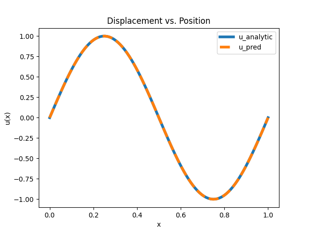
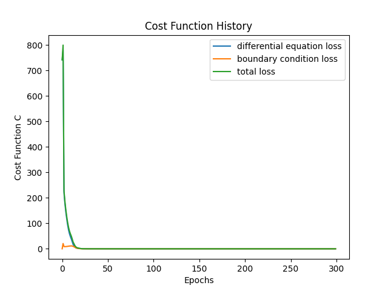
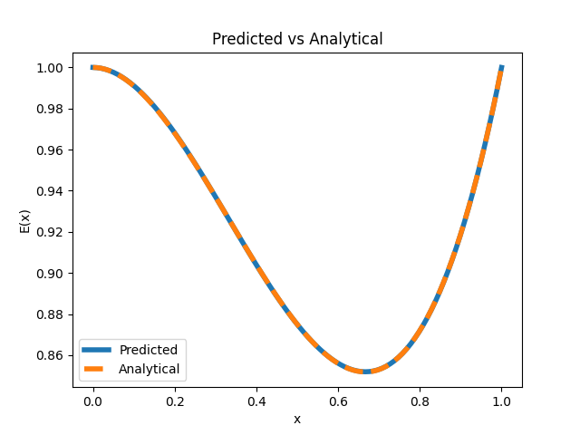
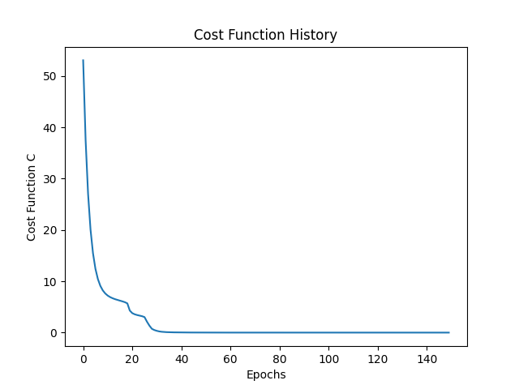

---
title: "Assignment 6 Plots"
author: "Shailja Kant Tiwari"
header-includes:
- \usepackage{amssymb,amsmath,geometry}
- \setmainfont{TeX Gyre Schola}
- \setmathfont{TeX Gyre Schola Math}
output:
pdf_document
---

# Assignment 6

## Problem: 1

This is Displacement vs Position graph for Displacement vs x for both Predicted and Actual values. Here Analytical Solution is $u(x) = \sin(2\pi x)$

---

This is the Plot of the Different types of Loss Functions while training the model.

---

## Problem: 2

This the plot of E(x) vs x for both Predicted and Actual values. Here Analytical Solution is $E(x) = x^3 - x^2 + 1$

---

This is the Plot of the Differential Loss/Total Loss vs Epochs as here we don't have any Boundary Loss.